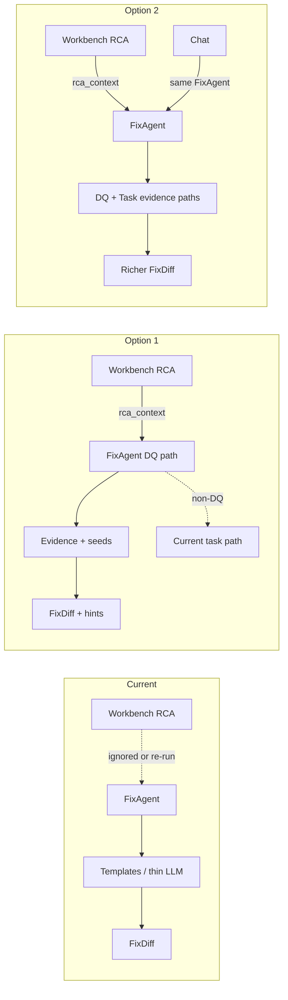

# Identify & Suggest Fix — Current vs Option 1 vs Option 2

Side-by-side comparison of what **already works in the codebase** versus the two proposed approaches.

---

## Current approach (what ships today)

**Entry points**

| Path | Behavior today |
|------|----------------|
| Workbench **Identify & Suggest Fix** | `api.fix(selected.id)` → `FixAgent.suggest(pipeline_id)` with **no** RCA payload |
| Chat “suggest fix” on a **task** | `FixAgent().suggest(pipeline_id)` |
| Chat “suggest fix” on a **DQ** id | Often `_dq_resolution_reply` → prose bullet steps (not a real before/after FixDiff), or FixAgent with `incident_id` set |

**Backend flow (`fix_agent.py`)**

1. Load pipelines from `MonitoringAgent().collect()` (tasks — DQ rows often missing from this index).
2. If `incident_id` is **absent** → re-run full `RCAAgent().analyze(pipeline_id)` (expensive duplicate of Workbench RCA).
3. If `incident_id` is **present** → `rca = None` (**discards** all RCA / diagnostic evidence).
4. Artifact body = pipeline `error` string (or a placeholder comment) — **not** DQ rule SQL / real task SQL as primary source.
5. LLM gets: category, error, optional `code_analysis.task_sql` + short summary — **not** `diagnostic_results`, evidence facts, or offending rows.
6. Fallback templates: hardcoded OOM broadcast join, NaN `TRY_TO_NUMBER`, DynamoDB WCU — demo-shaped; otherwise appends `-- TODO: apply category-specific fix --`.

**UI today**

- `FixDiff`: title, target, risk, rationale, before/after, rollback, modify + validate.
- Does **not** show validation hints or evidence grounding.
- Flow works end-to-end (button → API → diff card → optional validate).

**What currently works well**

- Button + API + FixDiff plumbing is live.
- LLM can sometimes produce a useful SQL edit when RCA re-run returns `task_sql`.
- Validate/Test agent hook exists after Fix.
- Non-DQ chat can call FixAgent.

**What currently fails for your DQ cases (234 / 235 / 306 / 13)**

- Does not consume RCA diagnostic offenders (brand/segment/counts).
- DQ artifact is weak (error text / missing monitoring index row).
- Passing `incident_id` (auto-remediate / some chat paths) **zeros out** RCA context.
- Generic TODO when templates don’t match.
- Chat DQ path often returns bullets instead of the same FixDiff as Workbench.

---

## Comparison matrix

| Dimension | Current (codebase) | Option 1 — DQ only | Option 2 — Full e2e |
|-----------|--------------------|--------------------|---------------------|
| Reuse Workbench RCA | No (re-runs or drops) | Yes (`rca_context`) | Yes |
| Use `diagnostic_results` / evidence facts | No | Yes (required for DQ) | Yes (DQ + task where available) |
| DQ artifact | Error / placeholder | DQ rule `SQL_CODE` | Same as Option 1 |
| Deterministic seeds (NULLIF, etc.) | Demo templates only | Yes for DQ patterns | Yes for DQ + more task patterns |
| Vague TODO fallback for DQ | Common | Guardrailed away when evidence exists | Same for DQ |
| Task / Glue / Dynamo fix quality | Thin templates + thin LLM | **Unchanged** | Reworked to use real task SQL from RCA |
| Chat DQ “suggest fix” | Bullets / weak FixAgent | Unchanged (Workbench-focused) | Routed through FixAgent FixDiff |
| FixDiff shows evidence / hints | No | Light add (hints + evidence summary) | Richer FixDiff |
| Memory of accepted fixes | Flag only | Unchanged | Prefer returning prior fix content |
| Validate/Test agent | Existing hook | Unchanged | Optionally consume validation hints |
| Effort | — | Smaller | Larger |
| Risk to existing flows | — | Low (DQ path additive) | Medium (more agents/UI) |
| Matches recent DQ RCA work | Partially (RCA good, Fix not) | Directly | Broader product polish |

---

## Same failure — what each produces (illustrative)

### QC 13 (division by zero)

| | Likely output |
|--|----------------|
| **Current** | Re-run RCA; LLM may mention NULLIF if lucky; else TODO / generic data template |
| **Option 1** | Seeded `before` = unsafe `/ b.TOTAL_HCP_CALLS`; `after` = `NULLIF(...)`; rationale cites execution error |
| **Option 2** | Same as Option 1 for this DQ case |

### QC 234 / 235 (layer NBRx, brand mismatch)

| | Likely output |
|--|----------------|
| **Current** | Ignores XIGDUO XR / JARDIANCE evidence rows; vague or TODO fix |
| **Option 1** | Before/after or verification SQL grounded in named brands + L2/L3 gaps from RCA evidence |
| **Option 2** | Same for DQ; also improves non-DQ task fixes elsewhere |

### Snowflake task failure (non-DQ)

| | Likely output |
|--|----------------|
| **Current** | Template or LLM on error text + optional task SQL |
| **Option 1** | **Same as current** (intentionally out of scope) |
| **Option 2** | Evidence-grounded from RCA task SQL / procedure chain; fewer demo templates |

---

## Architecture sketch

---

## Recommendation

**Selected direction (per product goal):** **Option 2 + Validate/Test trustworthiness.**

After RCA, fixes must be trustworthy in **Workbench and chat**, and **Validate** must exercise real `validation_hints` so apply → test can pass—not demo PASS cases.

- Option 1 alone is **not enough** for that goal (leaves task/chat/Test as they are today).
- Implement Option 2 phased: context plumbing → DQ+task FixAgent → chat same payload → TestAgent from hints → UI/skill.

See the active plan: `.cursor/plans/dq_suggest_fix_6101a076.plan.md` (Trustworthy Identify & Suggest Fix).

| | Option 1 | Option 2 (selected) |
|--|----------|---------------------|
| Focus | DQ only | DQ + tasks + chat + validate |
| Speed | Faster | Slower |
| Risk | Lower | Medium |
| Matches “apply fix → tests pass” | Partial (DQ Workbench only) | Yes (stated goal) |

---

## File pointers

| Approach | Doc |
|----------|-----|
| Option 1 detail | [`fix_suggest_option1_dq_only.md`](fix_suggest_option1_dq_only.md) |
| Option 2 detail | [`fix_suggest_option2_full_e2e.md`](fix_suggest_option2_full_e2e.md) |
| Current implementation | [`backend/app/agents/fix_agent.py`](backend/app/agents/fix_agent.py), [`frontend/src/components/Workbench.jsx`](frontend/src/components/Workbench.jsx), [`backend/app/agents/chat_agent.py`](backend/app/agents/chat_agent.py) |
