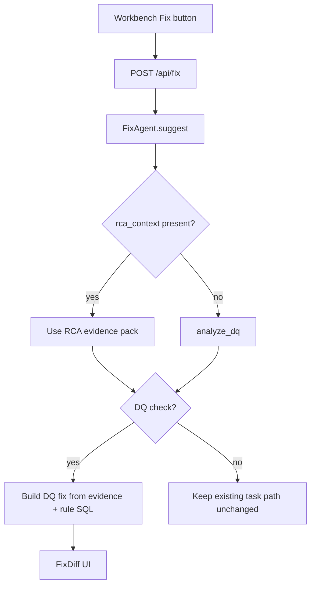

# Option 1 — DQ-only Identify & Suggest Fix

**Scope:** Evidence-grounded fixes for **failed DQ checks only**. Task/pipeline Fix path stays as-is.

**Best if:** You want the same quality jump you got on DQ RCA, with the smallest change set and fastest delivery.

**Full three-way compare (Current vs Opt1 vs Opt2):** [`fix_suggest_comparison_current_vs_options.md`](fix_suggest_comparison_current_vs_options.md)

---

## vs Current approach (what works today)

| | Current codebase | Option 1 |
|--|------------------|----------|
| Workbench → Fix | Sends only `pipeline_id`; Fix re-runs RCA or uses thin context | Sends slim `rca_context` from the RCA already on screen |
| DQ evidence | Not used (`diagnostic_results` ignored) | Required input to seed before/after |
| Artifact | Monitoring `error` / placeholder | DQ rule `SQL_CODE` |
| `incident_id` | If set → `rca = None` (bug/quirk) | Never drop RCA when context exists |
| Fallback | Demo templates or `-- TODO: apply…` | Deterministic DQ seeds + guardrail |
| Task failures | Existing templates/LLM | **Unchanged** |
| Chat DQ suggest | Bullets / weak path | **Unchanged** this pass |
| UI | FixDiff works; no evidence/hints | Add hints + evidence summary only |

Current stack that already works: button → `POST /api/fix` → `FixDiff` → optional Validate. Option 1 **keeps that plumbing** and upgrades the DQ brain behind it.

---

## Problem

`FixAgent` ignores RCA `diagnostic_results` / evidence facts, uses pipeline error text as the artifact, and skips RCA when `incident_id` is set. Workbench already has a rich DQ RCA but calls `/api/fix` with no context → generic TODO patches.

## Approach

Same evidence-first pattern as DQ RCA:

**facts → deterministic seed → LLM polish → guardrail if vague**

## What changes

| Area | Change |
|------|--------|
| API | Add optional `rca_context` to `FixRequest` |
| FixAgent | Never drop RCA; new `_suggest_dq_fix` with evidence + deterministic seeds (NULLIF, layer mismatch, duplicates) |
| `fix.md` | DQ evidence-first rules |
| Workbench | Pass slim `rca_context` + `incident_id` |
| FixDiff | Show `validation_hints` + evidence summary |

## Out of scope

- Task / Glue / Dynamo template overhaul
- Chat-agent DQ bypass rewrite
- Validate / Test agent changes
- Large Fix UI redesign

## Effort & risk

- **Effort:** Smaller (4 focused todos)
- **Risk:** Low — non-DQ path untouched
- **Outcome:** QC 13 / 234 / 235 / 306 get concrete before/after SQL grounded in the same offenders RCA named

## Success criteria

- Identify & Suggest Fix on DQ failures yields real before/after SQL (e.g. `NULLIF` for QC 13; brand/segment remediation for layer checks)
- No `-- TODO: apply category-specific fix --` when DQ evidence exists
- Fix reuses Workbench RCA context instead of discarding it

## Key files

- `backend/app/agents/fix_agent.py`
- `backend/app/models/schemas.py`
- `backend/app/skills/fix.md`
- `backend/app/main.py` / `orchestrator.py`
- `frontend/src/components/Workbench.jsx`
- `frontend/src/api/client.js`
