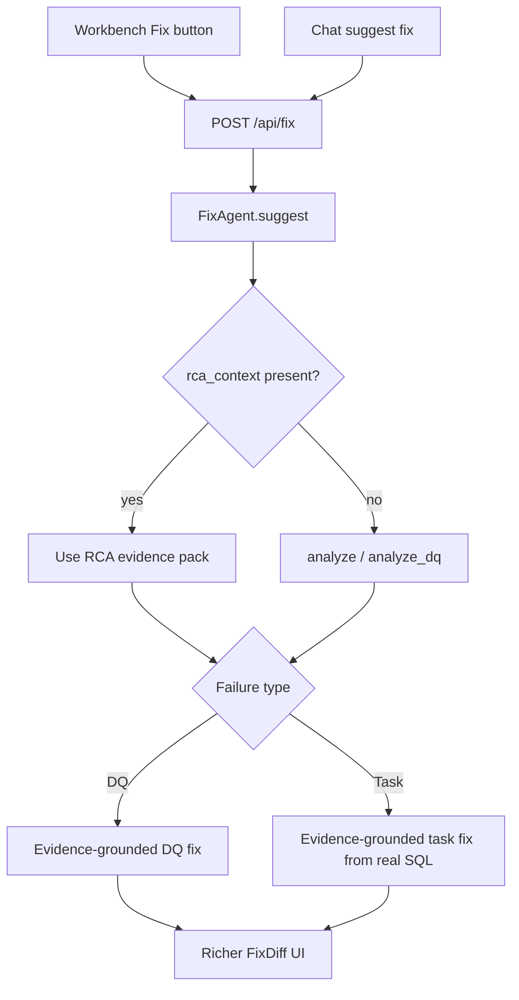

# Option 2 — Full end-to-end Identify & Suggest Fix

**Scope:** Everything in Option 1 (DQ evidence-grounded fixes), **plus** task/pipeline fix quality and a clearer Workbench Fix UI.

**Best if:** You want Identify & Suggest Fix to work well for **all** Workbench failures (DQ + Snowflake tasks + related pipelines), not only DQ.

**Full three-way compare (Current vs Opt1 vs Opt2):** [`fix_suggest_comparison_current_vs_options.md`](fix_suggest_comparison_current_vs_options.md)

---

## vs Current approach (what works today)

| | Current codebase | Option 2 |
|--|------------------|----------|
| Workbench → Fix | `pipeline_id` only; re-run or thin RCA | Reuse `rca_context` (same as Option 1) |
| DQ evidence | Ignored | Evidence-first (same as Option 1) |
| Task artifact | Error string + demo string-replace templates | Real task/procedure SQL from RCA; templates last resort |
| Chat DQ “suggest fix” | `_dq_resolution_reply` bullets / Fix with `incident_id` clearing RCA | Same FixAgent before/after as Workbench |
| FixDiff | Basic before/after (works) | Richer: evidence, hints, clearer risk/rollback |
| Accepted-fix memory | `reused_from_memory` flag only | Prefer returning prior accepted fix content |
| Validate/Test | Hook exists, hints unused | Can consume `validation_hints` |
| Risk / effort | Baseline | Higher than Option 1; builds on current API/UI rather than replacing them |

Current stack that already works: Workbench Fix button, `/api/fix`, `FixDiff`, Validate button, chat intent routing. Option 2 **keeps those entry points** and upgrades DQ + task brains and presentation.

---

## Problem

Same DQ gaps as Option 1, **and**:

- Task/pipeline fixes still use thin templates (OOM broadcast, NaN CAST demos) and error-text-as-artifact
- Chat “suggest fix” on DQ bypasses `FixAgent` entirely (generic bullets, no before/after)
- FixDiff UI does not show grounding, validation hints, or clear next steps
- `incident_id` / auto-remediate path discards RCA context

## Approach

Build Option 1 first as the foundation, then extend the same evidence-first contract to tasks and polish the UI.

## What changes

### Phase A — Same as Option 1 (DQ)

| Area | Change |
|------|--------|
| API | Optional `rca_context` on `FixRequest` |
| FixAgent | DQ path: evidence facts, rule SQL, deterministic seeds, LLM guardrail |
| `fix.md` | DQ evidence-first rules |
| Workbench | Pass slim `rca_context` |

### Phase B — Task / pipeline fixes

| Area | Change |
|------|--------|
| FixAgent | For non-DQ: use RCA `code_analysis.task_sql`, procedure chain, and error as artifact (not monitoring error blob alone) |
| Deterministic seeds | Expand beyond demo templates: NULLIF/TRY_CAST, warehouse sizing from infra RCA, permission grant stubs from access errors |
| Templates | Retire/replace hardcoded OOM/NaN demos as primary path; keep only as last-resort fallback |
| Memory | When prior accepted fix exists for signature, prefer returning that content (not just a UI flag) |

### Phase C — Chat + UI

| Area | Change |
|------|--------|
| Chat agent | Route DQ “suggest fix” through `FixAgent` (same before/after as Workbench), not `_dq_resolution_reply` bullets only |
| FixDiff | Show evidence summary, validation hints, risk/rollback clearly; optional “grounded in N offending rows” line |
| Modify flow | Keep edit → regenerate; preserve evidence pack on `user_edit` |

### Phase D — Optional later (still in Option 2 roadmap)

- Tighten Validate/Test agent to use `validation_hints` from the evidence-grounded fix
- Auto-remediate: pass full RCA context instead of `incident_id`-only

## Out of scope (even for Option 2)

- Applying fixes to production Snowflake automatically
- Full redesign of Dashboard layout
- AWS Glue/Step Functions deep editors beyond SQL/task bodies already in RCA

## Effort & risk

- **Effort:** Larger (Option 1 + task path + chat + UI)
- **Risk:** Medium — touches more agents/UI; DQ quality still ships first if phased A→B→C
- **Outcome:** One consistent Identify & Suggest Fix experience for DQ and task failures

## Success criteria

- All Option 1 DQ success criteria
- Task failures get before/after from **real** task/procedure SQL when RCA has it
- Chat “suggest fix” on a DQ id returns the same style of FixDiff payload (not only prose bullets)
- FixDiff always shows why the fix was chosen (evidence / hints)

## Key files

**Option 1 files, plus:**

- `backend/app/agents/chat_agent.py` (DQ suggest-fix routing)
- `backend/app/agents/fix_agent.py` (task path rewrite)
- `frontend/src/components/Workbench.jsx` (`FixDiff` richer presentation)
- Possibly `backend/app/agents/test_agent.py` if wiring validation hints

## How to choose vs Option 1

| | Option 1 | Option 2 |
|--|----------|----------|
| Focus | DQ only | DQ + tasks + chat + UI |
| Speed | Faster | Slower |
| Risk | Lower | Higher |
| Matches recent RCA work | Directly | Broader product polish |
